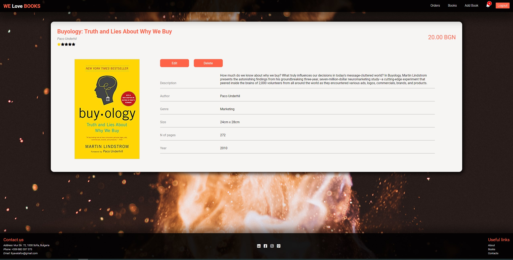
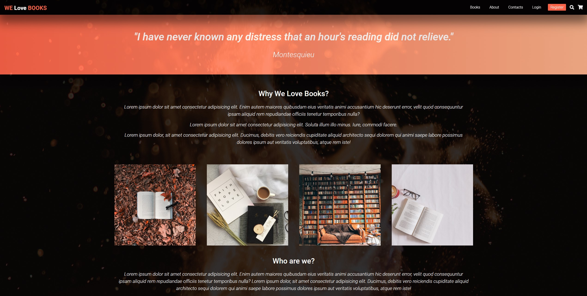
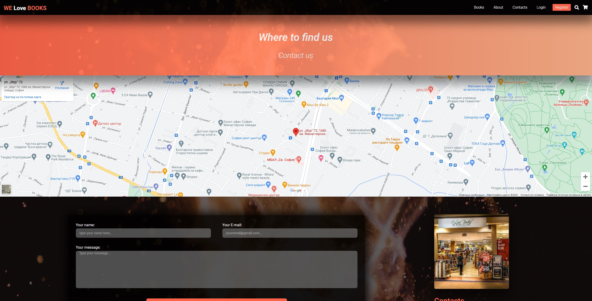
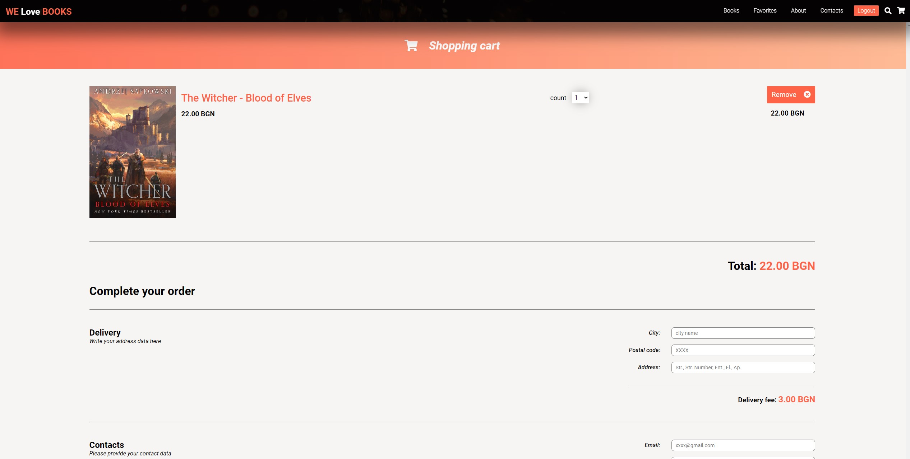
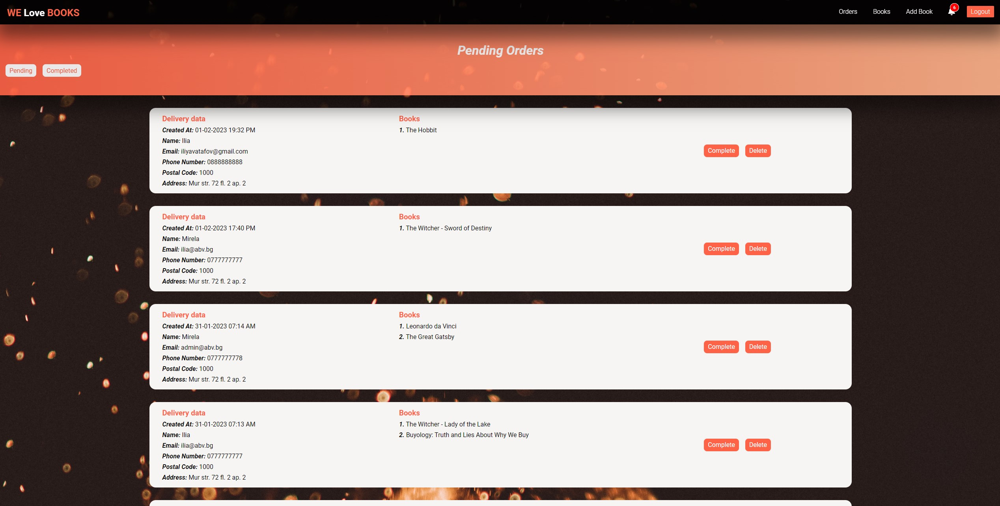
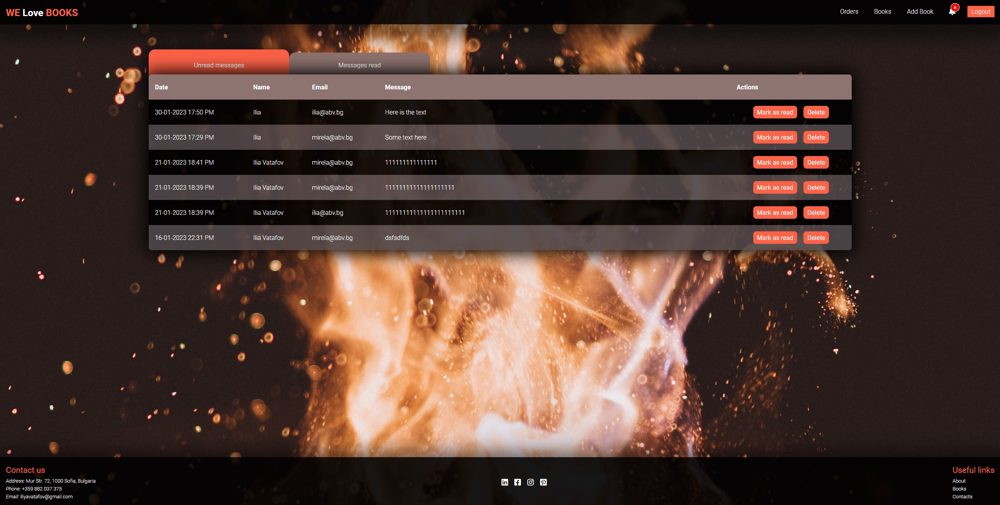

<h1 align="center"><i>WE Love BOOKS</i></h1>

 An online bookstore that provides users with the ability to purchase, rate, and add books to their favorite collection, WE Love BOOKS offers a seamless shopping experience. The platform also includes an admin panel that gives the site administrator basic tools to manage orders and messages from customers.

      <a href="https://welovebooks.online/">
    
    

    
    

    
    

    
    

    
    

    
    

    
    

    
    

    </a>

<h4 align="center"><i>Stack: </i></h3>

<h1 align="center">THE WHOLE APP IS CUSTOM!</h1>
<h3 align="center">Built from scratch</h3>

**Features of the platform**

- <i><b>Responsive Design</b></i>
   
- <i><b>Home page with carousel and top listings</b></i>
   
- <i><b>Auth (Register, Login) with validations</b></i>
   
- <i><b>Books page - books listing</b></i>
   
- <i><b>Book details</b></i>
- <i><b>Update book (admin only)</b></i>
- <i><b>Delete book (admin only)</b></i>
- <i><b>Add book to cart (every user exept admin)</b></i>
- <i><b>Add book to favorites (logged in user only)</b></i>
- <i><b>Delete book from favorites (logged in user only)</b></i>
   
- <i><b>Create book (admin only)</b></i>
   
- <i><b>Cart page</b></i>
- <i><b>Delete book from cart (every user exept admin)</b></i>
- <i><b>Dropdown to choose count of books</b></i>
- <i><b>Form with validations for delivery and contact data</b></i>
   
- <i><b>Recap page</b></i>
- <i><b>Edit order</b></i>
- <i><b>Confirm order</b></i>
   
- <i><b>About page</b></i>
   
- <i><b>Contacts page</b></i>
- <i><b>Integration with google maps API</b></i>
- <i><b>Contact form with validations</b></i>
   
- <i><b>Favorites page (logged in users only)</b></i>
   
- <i><b>Messages page - read and unread view (admin only)</b></i>
- <i><b>Delete message</b></i>
- <i><b>Mark as read</b></i>
- <i><b>Mark as unread</b></i>
   
- <i><b>Orders page - pending and completed view (admin only)</b></i>
- <i><b>Delete order</b></i>
- <i><b>Complete order</b></i>
- <i><b>Mark as pending</b></i>
   
- <i><b>others (validation service, loading spinner, modal to inform user for errors or result of requests for better UI)</b></i>

The repo includes "<i>front-end</i>" of the app. "<i>Back-end</i>" is provided by BaaS - Firebase.

Dependencies, (besides Create-React-App deps):

- "firebase"
- "react-router-dom"
- "moment"
- "uuid"
- "crypto-js"

Admin account:

- username: ilia@abv.bg
- password: Qwerty1!

<h2>Hosted at <a href="https://welovebooks.online/"/>https://welovebooks.online/</h2>
